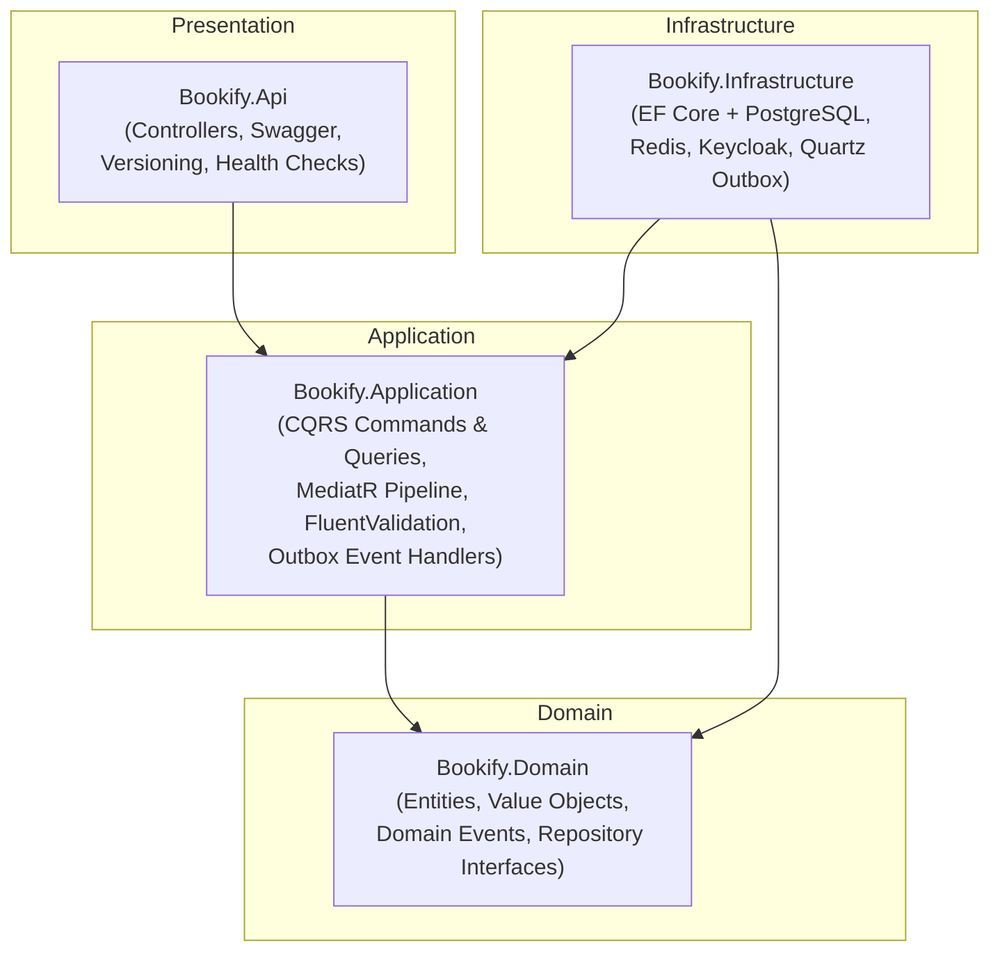
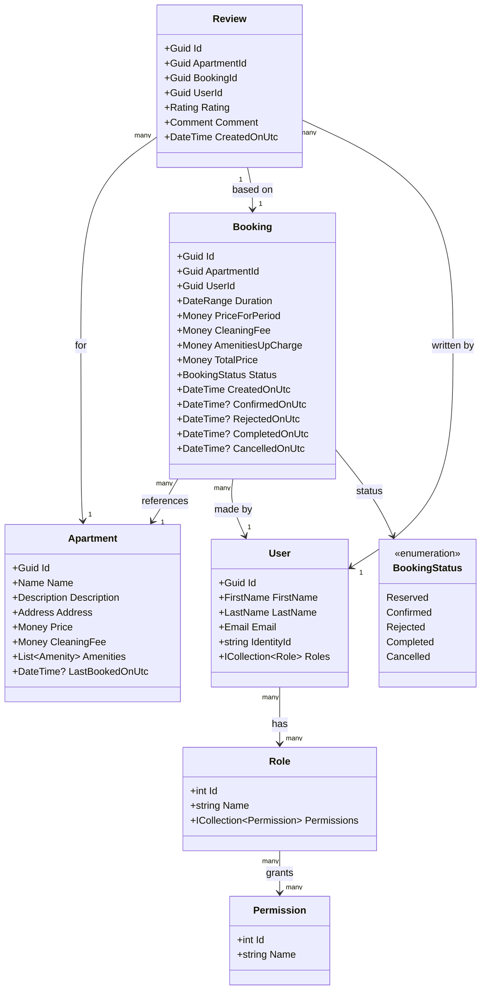
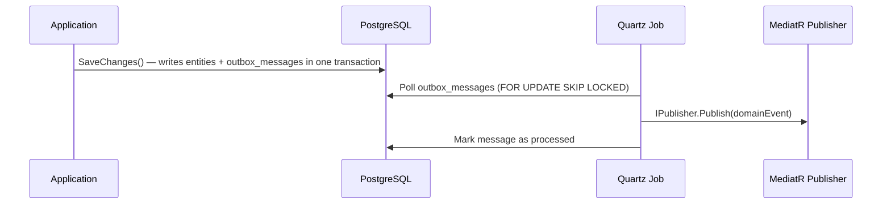
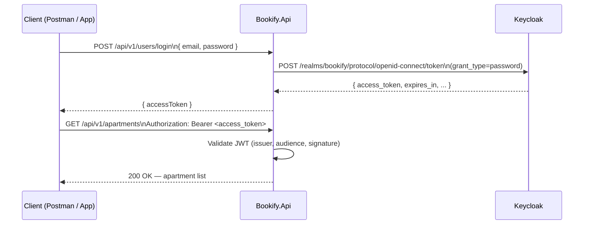
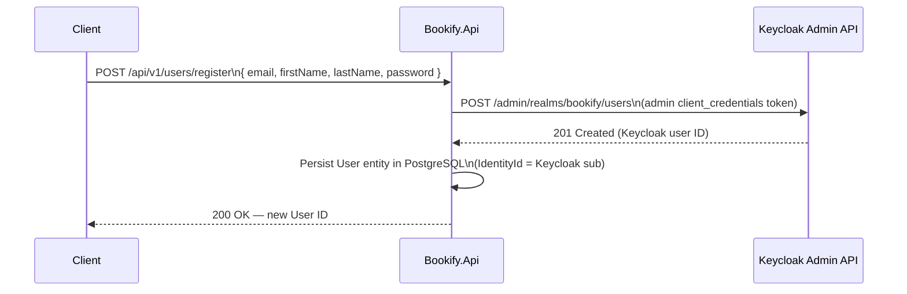

# Bookify

A production-ready **apartment booking REST API** built with **.NET 8** and **Clean Architecture**.


---

## Table of Contents

1. [Architecture](#architecture)
2. [Domain Model](#domain-model)
3. [Application Layer — CQRS](#application-layer--cqrs)
   - [Concurrency & Overlap Prevention](#concurrency--overlap-prevention)
4. [API Endpoints](#api-endpoints)
5. [Infrastructure](#infrastructure)
6. [Running the Project](#running-the-project)
7. [Configuration](#configuration)
8. [Authentication Flow](#authentication-flow)
9. [Testing](#testing)
10. [Postman Collection](#postman-collection)
11. [Project Structure](#project-structure)

---

## Architecture

Bookify follows **Clean Architecture** with four layers. Dependencies point inward: outer layers depend on inner layers, never the reverse.



### Layer descriptions

| Layer | Project | Responsibility |
|-------|---------|---------------|
| **Domain** | `Bookify.Domain` | Core business logic — entities, value objects, domain events, repository interfaces, no framework dependencies |
| **Application** | `Bookify.Application` | Use cases (Commands & Queries via MediatR), pipeline behaviors (logging, validation, caching), domain event handlers, service abstractions |
| **Infrastructure** | `Bookify.Infrastructure` | All I/O — EF Core with PostgreSQL, Redis distributed cache, Keycloak HTTP clients, Quartz outbox processor, Dapper for raw SQL |
| **Presentation** | `Bookify.Api` | REST controllers, Swagger UI, API versioning, Serilog structured logging to Seq, health checks endpoint |

---

## Domain Model


### Aggregates and Entities

In Domain-Driven Design, an **aggregate** is a cluster of domain objects treated as a single unit. All changes go through the **aggregate root**, which enforces invariants and raises domain events.

| Type | Class | Aggregate Root? | Notes |
|------|-------|:--------------:|-------|
| **Aggregate root** | `Apartment` | Yes | Owns its `Address` and `Amenities`; `LastBookedOnUtc` is updated by the `Booking` aggregate on reservation |
| **Aggregate root** | `Booking` | Yes | Core aggregate — encapsulates all state transitions (Reserve → Confirm / Reject → Complete / Cancel); raises domain events on every transition |
| **Aggregate root** | `User` | Yes | Created via static factory `User.Create`; owns its `Role` memberships; `IdentityId` ties it to the Keycloak account |
| **Aggregate root** | `Review` | Yes | Can only be created against a `Completed` booking; `Review.Create` enforces that invariant |
| **Entity** | `Role` | No | Belongs to the authorization model; seeded (`Registered`); navigated from `User` |
| **Entity** | `Permission` | No | Belongs to the authorization model; seeded (`users:read`); navigated from `Role` |

Each aggregate root has its own repository interface (`IApartmentRepository`, `IBookingRepository`, `IUserRepository`, `IReviewRepository`) and is persisted as a separate EF Core `DbSet`. Cross-aggregate references use IDs only — never direct navigation properties across aggregate boundaries.

### Value Objects

| Value Object | Used By |
|-------------|---------|
| `Money` + `Currency` | `Apartment` (Price, CleaningFee), `Booking` (all price fields) |
| `DateRange` | `Booking` (Duration — wraps Start + End dates) |
| `Address` | `Apartment` |
| `Amenity` | `Apartment` (enum value object) |
| `Rating` | `Review` (1–5 validated integer) |
| `Comment` | `Review` (non-empty string) |
| `FirstName` / `LastName` / `Email` | `User` |

### Domain Events

Domain events express something significant that happened in the domain. They are raised inside aggregate methods, persisted to the `outbox_messages` table within the same `SaveChanges` transaction, and published asynchronously by the Quartz outbox job via MediatR.

| Event | Raised by | Handler (`INotificationHandler`) |
|-------|-----------|----------------------------------|
| `BookingReservedDomainEvent` | `Booking.Reserve` | `BookingReservedDomainEventHandler` — loads the booking and user, then sends a "Booking reserved!" confirmation email via `IEmailService`. User has 10 minutes to confirm. |
| `BookingConfirmedDomainEvent` | `Booking.Confirm` | No handler (reserved for future use) |
| `BookingRejectedDomainEvent` | `Booking.Reject` | No handler (reserved for future use) |
| `BookingCompletedDomainEvent` | `Booking.Complete` | No handler (reserved for future use) |
| `BookingCancelledDomainEvent` | `Booking.Cancel` | No handler (reserved for future use) |
| `UserCreatedDomainEvent` | `User.Create` | No handler (reserved for future use) |
| `ReviewCreatedDomainEvent` | `Review.Create` | No handler (reserved for future use) |

---

## Application Layer — CQRS

The application layer implements CQRS using **MediatR**. Every use case is either a **Command** (writes / side effects) or a **Query** (reads only). All messages flow through a shared pipeline of behaviors before reaching the handler.

### MediatR Pipeline Behaviors

```
Request
  └── LoggingBehavior          (logs command/query name + execution time)
        └── ValidationBehavior (runs FluentValidation; returns error if invalid)
              └── QueryCachingBehavior (checks/writes Redis cache for ICachedQuery)
                    └── Handler
```

### Commands

| Command | Input | Returns | Description |
|---------|-------|---------|-------------|
| `ReserveBookingCommand` | `ApartmentId`, `UserId`, `StartDate`, `EndDate` | `Guid` (BookingId) | Creates a new booking in `Reserved` status; raises `BookingReservedDomainEvent` |
| `ConfirmBookingCommand` | `BookingId` | — | Transitions booking from `Reserved` → `Confirmed` |
| `RejectBookingCommand` | `BookingId` | — | Transitions booking from `Reserved` → `Rejected` |
| `CompleteBookingCommand` | `BookingId` | — | Transitions booking from `Confirmed` → `Completed` |
| `CancelBookingCommand` | `BookingId` | — | Transitions booking from `Confirmed` → `Cancelled` |
| `RegisterUserCommand` | `Email`, `FirstName`, `LastName`, `Password` | `Guid` (UserId) | Creates Keycloak account via admin API + persists `User` entity |
| `LogInUserCommand` | `Email`, `Password` | `AccessTokenResponse` | Exchanges credentials for a Keycloak JWT via token endpoint |
| `AddReviewCommand` | `BookingId`, `Rating`, `Comment` | — | Creates a `Review`; only allowed when booking is `Completed` |

### Queries

| Query | Input | Returns | Cached? | Description |
|-------|-------|---------|:-------:|-------------|
| `SearchApartmentsQuery` | `StartDate`, `EndDate` | `IReadOnlyList<ApartmentResponse>` | No | Finds apartments with no overlapping confirmed/reserved bookings in the range (Dapper) |
| `GetBookingQuery` | `BookingId` | `BookingResponse` | Yes (`bookings-{id}`) | Fetches a single booking with pricing details (Dapper, Redis-cached) |
| `GetLoggedInUserQuery` | — | `UserResponse` | No | Reads the authenticated user's profile from the database |

### Concurrency & Overlap Prevention

Two distinct problems can arise when multiple users try to book the same apartment concurrently: **date overlap** (two reservations covering the same dates) and **lost updates** (two transactions reading the same row and both writing back before either sees the other's change). Bookify addresses each at a different layer.

#### 1. Overlap Check (Application Layer)

Before a new booking is persisted, `ReserveBookingCommandHandler` calls `IBookingRepository.IsOverlappingAsync`. The repository queries the `bookings` table for any existing booking that satisfies **all three** conditions simultaneously:

```
booking.ApartmentId == requested.ApartmentId
AND  booking.Duration.Start <= requested.EndDate
AND  booking.Duration.End   >= requested.StartDate
AND  booking.Status IN (Reserved, Confirmed, Completed)
```

This is the standard **interval-overlap predicate**: two date ranges `[A, B]` and `[C, D]` overlap when `A ≤ D AND B ≥ C`. Only *active* statuses (`Reserved`, `Confirmed`, `Completed`) are checked; `Rejected` and `Cancelled` bookings are intentionally ignored so that the same dates can be re-booked after a cancellation.

If an overlap is detected the handler immediately returns `BookingErrors.Overlap` without touching the database.

#### 2. Optimistic Concurrency (Infrastructure Layer)

The overlap check alone is not race-condition proof. Between the moment the query returns "no overlap" and the moment `SaveChangesAsync` commits the new row, a second concurrent request could pass the same check and write first — a classic **TOCTOU** (time-of-check / time-of-use) race.

The `Apartment` entity carries an EF Core **row-version token** configured in `ApartmentConfiguration`:

```csharp
builder.Property<uint>("Version").IsRowVersion();
```

Postgres maps this to an `xmin` system column (a monotonically increasing transaction ID). Every time a row is modified, Postgres automatically increments `xmin`. EF Core includes the current `Version` value in every `UPDATE` statement's `WHERE` clause:

```sql
UPDATE apartments SET last_booked_on_utc = @p0
WHERE id = @p1 AND "Version" = @p2   -- optimistic lock
```

`Booking.Reserve` updates `apartment.LastBookedOnUtc`, so the save always touches the `apartments` row. If a concurrent transaction already committed a change to the same row, the `Version` will have changed and EF Core's `UPDATE` will match **zero rows**. EF Core detects this and throws a `DbUpdateConcurrencyException`.

`ApplicationDbContext.SaveChangesAsync` catches that exception and re-throws it as the application-level `ConcurrencyException`:

```csharp
catch (DbUpdateConcurrencyException ex)
{
    throw new ConcurrencyException("Concurrency exception occurred.", ex);
}
```

`ReserveBookingCommandHandler` in turn catches `ConcurrencyException` and maps it to the same `BookingErrors.Overlap` result, so the caller always receives a consistent, domain-meaningful error regardless of which layer detected the conflict:

```csharp
catch (ConcurrencyException)
{
    return Result.Failure<Guid>(BookingErrors.Overlap);
}
```

#### How the Two Layers Work Together

```
Request A ──► IsOverlappingAsync → false ──► Booking.Reserve ──► SaveChangesAsync ✓ (Version 1→2)
Request B ──► IsOverlappingAsync → false ──► Booking.Reserve ──► SaveChangesAsync ✗ (Version still 1)
                                                                       │
                                                              DbUpdateConcurrencyException
                                                                       │
                                                              ConcurrencyException
                                                                       │
                                                          Result.Failure(BookingErrors.Overlap)
```

The overlap check is a **fast, early exit** that eliminates the vast majority of conflicts without ever touching the write path. The row-version token is a **safety net** that guarantees correctness even in the rare race condition where two requests slip through the check simultaneously.

---

## API Endpoints

Base path: `/api/v{version}` — current version: **v1**

Swagger UI is available at `/swagger` when running in **Development** or **Docker** environments.

### Apartments

| Method | Route | Auth | Description |
|--------|-------|------|-------------|
| `GET` | `/api/v1/apartments?startDate=YYYY-MM-DD&endDate=YYYY-MM-DD` | Bearer | Search apartments available in the given date range |

### Bookings

| Method | Route | Auth | Description |
|--------|-------|------|-------------|
| `POST` | `/api/v1/bookings` | Bearer | Reserve an apartment for a date range |
| `GET` | `/api/v1/bookings/{id}` | Bearer | Get a booking by ID |

### Users

| Method | Route | Auth | Description |
|--------|-------|------|-------------|
| `POST` | `/api/v1/users/register` | Anonymous | Register a new user (creates Keycloak account) |
| `POST` | `/api/v1/users/login` | Anonymous | Log in — returns a JWT access token |
| `GET` | `/api/v1/users/me` | Bearer + `users:read` | Get the currently authenticated user's profile |

### Reviews

| Method | Route | Auth | Description |
|--------|-------|------|-------------|
| `POST` | `/api/v1/reviews` | Bearer | Add a review for a completed booking |

### Health

| Method | Route | Auth | Description |
|--------|-------|------|-------------|
| `GET` | `/health` | Anonymous | Returns health status of PostgreSQL, Redis, and Keycloak |

---

## Infrastructure

### PostgreSQL (EF Core)

- Driver: **Npgsql.EntityFrameworkCore.PostgreSQL**
- Schema naming: **snake_case** via `EFCore.NamingConventions`
- Entity configurations in dedicated `IEntityTypeConfiguration<T>` classes
- Migrations applied automatically on startup in Development and Docker environments
- Raw SQL queries via **Dapper** (`ISqlConnectionFactory`) for read-side performance

### Redis (Distributed Cache)

- Driver: **StackExchange.Redis**
- `ICacheService` / `CacheService` wraps `IDistributedCache`
- `QueryCachingBehavior` MediatR pipeline behavior caches results for any query implementing `ICachedQuery<T>`

### Keycloak (Identity Provider)

- Keycloak runs as a separate container; the realm `bookify` is auto-imported from `.files/bookify-realm-export.json`
- **`JwtService`** — calls Keycloak's token endpoint (`grant_type=password`) for user login
- **`AuthenticationService`** — calls Keycloak's admin REST API for user registration
- **`AdminAuthorizationDelegatingHandler`** — obtains a `client_credentials` token automatically for admin API calls
- **`JwtBearerOptionsSetup`** — configures JWT validation: `MetadataAddress`, `ValidIssuer`, `Audience`
- Two Keycloak clients:
  - `bookify-auth-client` — resource-owner password grant (user-facing login)
  - `bookify-admin-client` — service-account client credentials (admin operations)

### Transactional Outbox Pattern (Quartz.NET)

Domain events are handled reliably without distributed transactions:



- Job: `ProcessOutboxMessagesJob` — runs every 10 seconds, batch size 10
- Serialization: Newtonsoft.Json with `TypeNameHandling.All`
- Failed messages record the exception and are not retried automatically

### Serilog & Seq

- Serilog enrichers: `FromLogContext`, `WithMachineName`, `WithThreadId`
- Sinks: **Console** + **Seq**
- Seq ingestion: port **5341** · Seq UI: **http://localhost:8081**
- Request logging via `UseSerilogRequestLogging()`; custom `RequestContextLoggingMiddleware` enriches logs with correlation IDs

### Health Checks

Registered via `AddHealthChecks()`:

| Check | Library |
|-------|---------|
| PostgreSQL | `AspNetCore.HealthChecks.NpgSql` |
| Redis | `AspNetCore.HealthChecks.Redis` |
| Keycloak | `AspNetCore.HealthChecks.Uris` |

JSON response at `GET /health` rendered by `HealthChecks.UI.Client`.

---

## Running the Project

### Prerequisites

- [Docker Desktop](https://www.docker.com/products/docker-desktop/)
- [.NET 8 SDK](https://dotnet.microsoft.com/download/dotnet/8.0) (only needed for Option B)

---

### Option A — Full Docker Compose (recommended)

Everything — API, database, cache, identity, logging — runs in containers.

```bash
git clone https://github.com/OmarMegahed1/Bookify.git
cd Bookify
docker compose up -d --build
```

Wait for all containers to become healthy, then access:

| Service | URL | Credentials |
|---------|-----|-------------|
| API + Swagger | http://localhost:5000/swagger | — |
| Keycloak Admin Console | http://localhost:18080 | `admin` / `admin` |
| Seq UI | http://localhost:8081 | `admin` / `admin123` |
| PostgreSQL | `localhost:5432` | `postgres` / `postgres` |
| Redis | `localhost:6379` | — |

> The override file (`docker-compose.override.yml`) sets `ASPNETCORE_ENVIRONMENT=Docker` so that `appsettings.Docker.json` is loaded, Kestrel listens on `http://+:5000`, and Windows User Secrets are mounted into the container.

**Stopping everything:**
```bash
docker compose down
```

---

### Option B — `dotnet run` with infrastructure containers

Run only the infrastructure in Docker, and start the API directly on your machine (useful for active development with hot reload).

```bash
# 1. Start infrastructure services only
docker compose up -d bookify-db bookify-redis bookify-idp bookify-seq

# 2. Run the API
cd src/Bookify.Api
dotnet run
```

The API picks up `appsettings.Development.json` (all services at `localhost`).

| Service | URL |
|---------|-----|
| API + Swagger | http://localhost:5000/swagger |
| Keycloak Admin Console | http://localhost:18080 |
| Seq UI | http://localhost:8081 |

---

### First-run notes

- **Migrations** and **seed data** are applied automatically on startup in Development and Docker environments.
- **Keycloak realm** `bookify` is imported from `.files/bookify-realm-export.json` on the first Keycloak start. Data persists in `.containers/identity/` (git-ignored).
- **Seq** first-run admin password is `admin123` (set via `SEQ_FIRSTRUN_ADMINPASSWORDHASH` to avoid the forced password-change prompt).
- `.containers/` holds all Docker volume data locally and is excluded from version control.

---

## Configuration

The solution uses two environment-specific `appsettings` files merged on top of `appsettings.json`:

| Setting | `appsettings.Development.json` (Option B) | `appsettings.Docker.json` (Option A) |
|---------|------------------------------------------|--------------------------------------|
| `ConnectionStrings:Database` | `Host=localhost;Port=5432;...` | `Host=bookify-db;Port=5432;...` |
| `ConnectionStrings:Cache` | `localhost:6379` | `bookify-redis:6379` |
| `Serilog Seq URL` | `http://localhost:5341` | `http://bookify-seq:5341` |
| `Authentication:Issuer` | `http://localhost:18080/realms/bookify` | `http://bookify-idp:8080/realms/bookify` |
| `Authentication:MetadataUrl` | `http://localhost:18080/realms/bookify/...` | `http://bookify-idp:8080/realms/bookify/...` |
| `Keycloak:BaseUrl` | `http://localhost:18080` | `http://bookify-idp:8080` |
| `Keycloak:TokenUrl` | `http://localhost:18080/realms/bookify/...` | `http://bookify-idp:8080/realms/bookify/...` |

> **Issuer note:** `Authentication:Issuer` must exactly match the `iss` claim in JWTs issued by Keycloak. When the API runs in Docker, it calls Keycloak via the internal hostname `bookify-idp:8080`, so Keycloak emits tokens with that issuer. When running with `dotnet run`, the mapped host port `localhost:18080` is used instead.

**Keycloak client configuration** (same in both files):

| Key | Value |
|-----|-------|
| `Keycloak:AuthClientId` | `bookify-auth-client` |
| `Keycloak:AuthClientSecret` | set in appsettings |
| `Keycloak:AdminClientId` | `bookify-admin-client` |
| `Keycloak:AdminClientSecret` | set in appsettings |

**Outbox:**

| Key | Default |
|-----|---------|
| `Outbox:IntervalInSeconds` | `10` |
| `Outbox:BatchSize` | `10` |

---

## Authentication Flow

Bookify uses **Keycloak** as the external identity provider. There are two ways to obtain a token:

### Via the Bookify API (recommended for end users)



### Via Keycloak directly (Postman Identity folder)

Use the **Identity → Access Token** Postman request to call the Keycloak token endpoint directly. This is useful for testing with the admin client or when debugging JWT claims.

### User registration flow



### Authorization

- JWT Bearer authentication is required on all routes except `register`, `login`, and `/health`
- Fine-grained **permission-based authorization** via `[HasPermission("users:read")]` attribute
- Permissions are seeded in the database: `Role.Registered` → `Permission.UsersRead`
- `CustomClaimsTransformation` loads user permissions from the database on each request

---

## Testing

The solution contains five test projects with different scopes:

| Project | Test Type | Tools |
|---------|-----------|-------|
| `Bookify.Domain.UnitTests` | Unit — pure domain logic | xUnit, FluentAssertions |
| `Bookify.Application.UnitTests` | Unit — application use cases | xUnit, NSubstitute, FluentAssertions |
| `Bookify.Application.IntegrationTests` | Integration — full app stack with real infra | xUnit, Testcontainers (Postgres, Redis, Keycloak), `WebApplicationFactory` |
| `Bookify.Api.FunctionalTests` | Functional — HTTP-level end-to-end tests | xUnit, Testcontainers, `WebApplicationFactory` |
| `Bookify.ArchitectureTests` | Architecture — layer dependency enforcement | NetArchTest.Rules |

Integration and functional tests spin up **real containers** via Testcontainers — no mocks for the database, cache, or identity provider.

```bash
# Run all tests
dotnet test

# Run a specific project
dotnet test test/Bookify.Domain.UnitTests
dotnet test test/Bookify.ArchitectureTests
```

### What is tested

- **Domain unit tests** — `Booking` state machine, `PricingService` calculations, `User` creation
- **Application unit tests** — `ReserveBookingCommandHandler` with mocked repositories
- **Integration tests** — `SearchApartmentsQuery`, `ConfirmBookingCommand`, `GetBookingQuery` against a real PostgreSQL instance
- **Functional tests** — `/api/v1/users/register`, `/api/v1/users/login`, `/api/v1/users/me` over HTTP
- **Architecture tests** — Domain does not depend on Application/Infrastructure/Api; Application does not depend on Infrastructure/Api; etc.

---

## Postman Collection

The file `Bookify -v2.1- Endpoints.postman_collection` at the repo root contains ready-to-use requests for every endpoint.

### Setup

1. Import the collection into Postman.
2. Set the collection variable `api_url`:
   - Docker Compose: `http://localhost:5000`
   - `dotnet run`: `http://localhost:5000`
3. Set the collection variable `keycloak_url` (for Identity requests): `http://localhost:18080`

### Getting a token

**Option 1 — Via the API:**
1. Call `Users → Log in User` with your credentials.
2. Copy `accessToken` from the response.
3. Set it as the Bearer token on any protected request.

**Option 2 — Directly from Keycloak:**
1. Call `Identity → Access Token` (uses `bookify-auth-client` with `grant_type=password`).
2. Copy `access_token` from the response body.

### Collection folders

| Folder | Requests |
|--------|----------|
| `Apartments` | Search Apartments |
| `Bookings` | Reserve Booking, Get Booking |
| `Users` | Log in User, Register User, Get Logged In User |
| `Identity` | Access Token, Access Token Admin, Keycloak Health |
| `Health` | API Health |

---

## Project Structure

```
Bookify/
├── src/
│   ├── Bookify.Domain/             # Entities, value objects, domain events, repository interfaces
│   │   ├── Apartments/
│   │   ├── Bookings/               # Booking aggregate, BookingStatus, PricingService, DateRange
│   │   ├── Reviews/
│   │   ├── Users/                  # User aggregate, Role, Permission
│   │   ├── Shared/                 # Money, Currency
│   │   └── Abstractions/           # Result<T>, IEntity, IDomainEvent
│   │
│   ├── Bookify.Application/        # Use cases, MediatR pipeline, abstractions
│   │   ├── Apartments/             # SearchApartmentsQuery
│   │   ├── Bookings/               # Reserve / Confirm / Reject / Complete / Cancel commands + GetBookingQuery
│   │   ├── Reviews/                # AddReviewCommand
│   │   ├── Users/                  # LogInUser, RegisterUser, GetLoggedInUser
│   │   └── Abstractions/           # ICommand, IQuery, ICachedQuery, ICacheService, IEmailService, ...
│   │
│   ├── Bookify.Infrastructure/     # External integrations
│   │   ├── Authentication/         # Keycloak JWT, JwtService, AuthenticationService
│   │   ├── Authorization/          # Permission handler, claims transformation
│   │   ├── Caching/                # Redis CacheService
│   │   ├── Outbox/                 # OutboxMessage, ProcessOutboxMessagesJob
│   │   ├── Repositories/           # EF Core repository implementations
│   │   ├── Configurations/         # Entity type configurations
│   │   └── ApplicationDbContext.cs
│   │
│   └── Bookify.Api/                # Presentation layer
│       ├── Controllers/            # Apartments, Bookings, Users, Reviews
│       ├── Extensions/             # Migration & seed extensions
│       ├── Middleware/             # Global exception handler, request context logging
│       ├── OpenApi/                # ConfigureSwaggerOptions (versioned Swagger + JWT)
│       ├── Dockerfile
│       └── Program.cs
│
├── test/
│   ├── Bookify.Domain.UnitTests/
│   ├── Bookify.Application.UnitTests/
│   ├── Bookify.Application.IntegrationTests/
│   ├── Bookify.Api.FunctionalTests/
│   └── Bookify.ArchitectureTests/
│
├── .files/
│   └── bookify-realm-export.json   # Keycloak realm auto-imported on first start
│
├── .containers/                    # Local Docker volume data — git-ignored
│   ├── database/                   # PostgreSQL data
│   ├── identity/                   # Keycloak data
│   └── seq/                        # Seq data
│
├── docker-compose.yml              # Service definitions
├── docker-compose.override.yml     # Local dev overrides (Docker env, port 5000)
├── Directory.Build.props           # Shared MSBuild settings (Nullable, ImplicitUsings)
├── .editorconfig                   # C# code style rules
├── Bookify -v2.1- Endpoints.postman_collection
└── Bookify.sln
```
